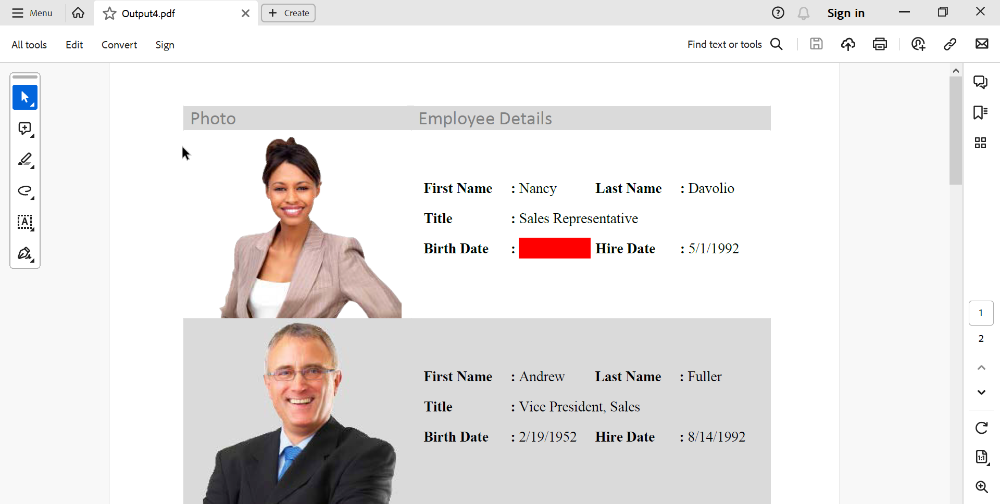
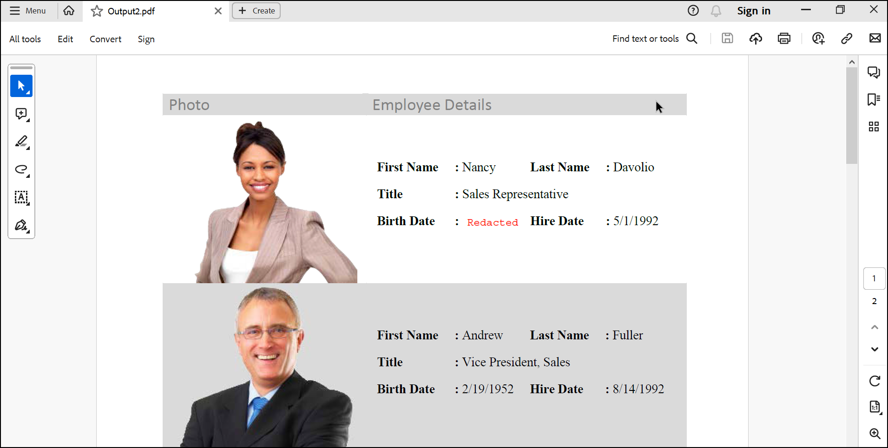
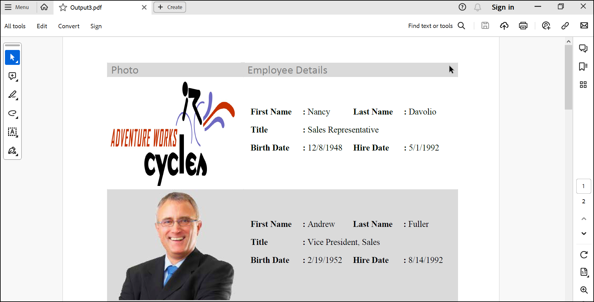

# How to Redact PDF Documents in .NET using the PDF Library

## Introduction
A quick start .NET console project that shows how to redact PDF documents using the Syncfusion&reg; PDF Library.

## System requirement
**Framework and SDKs**
* .NET SDK (version 5.0 or later)

**IDEs**
*  Visual Studio 2019/ Visual Studio 2022

## Code snippet for Redact PDF content from PDF documents
We will create a new .NET console application, add the Syncfusion&reg; PDF library package, and write the code

```csharp
 //Create stream from an existing PDF document. 
FileStream docStream = new FileStream("Input.pdf", FileMode.Open, FileAccess.Read);
//Load the existing PDF document.
PdfLoadedDocument document = new PdfLoadedDocument(docStream);
//Get the first page from the document.
PdfLoadedPage page = document.Pages[0] as PdfLoadedPage;
//Create a redaction object.
PdfRedaction redaction = new PdfRedaction(new RectangleF(343, 147, 60, 17));
//Add a redaction object into the redaction collection of loaded page.
page.AddRedaction(redaction);
//Redact the contents from the PDF document.
document.Redact();
//Create file stream.
using (FileStream outputFileStream = new FileStream("Output.pdf", FileMode.Create, FileAccess.ReadWrite)) {
    //Save the PDF document to file stream.
    document.Save(outputFileStream);
}
//Close the document.
document.Close(true);
```

**Output Image**


## Code snippet for Apply fill color to the redacted area
We will create a new .NET console application, add the Syncfusion&reg; PDF library package, and write the code

```csharp
//Get stream from an existing PDF document.
FileStream docStream = new FileStream("Input.pdf", FileMode.Open, FileAccess.Read);
//Load the PDF document. 
PdfLoadedDocument document = new PdfLoadedDocument(docStream);
//Get the first page from the document.
PdfLoadedPage page = document.Pages[0] as PdfLoadedPage;
//Create a PDF redaction for the page.
PdfRedaction redaction = new PdfRedaction(new RectangleF(343, 147, 60, 17));
//Set fill color for the redaction bounds.
redaction.FillColor = Color.Red;
//Add a redaction object into the redaction collection of loaded page.
page.AddRedaction(redaction);
//Redact the contents from the PDF document.
document.Redact();
//Create file stream.
using (FileStream outputFileStream = new FileStream("Output1.pdf", FileMode.Create, FileAccess.ReadWrite)) {
    //Save the PDF document to file stream.
    document.Save(outputFileStream);
}
//Close the document.
document.Close(true);
```

**Output Image**


## Code snippet for Display text on the redacted area
We will create a new .NET console application, add the Syncfusion&reg; PDF library package, and write the code

```csharp
//Get stream from an existing PDF document. 
FileStream docStream = new FileStream("Input.pdf", FileMode.Open, FileAccess.Read);
//Load the existing PDF document.
PdfLoadedDocument document = new PdfLoadedDocument(docStream);
//Get the first page from the document.
PdfLoadedPage page = document.Pages[0] as PdfLoadedPage;
//Create a redaction object.
PdfRedaction redaction = new PdfRedaction(new RectangleF(343, 147, 60, 17));
//Font for the overlay text.
PdfStandardFont font = new PdfStandardFont(PdfFontFamily.Courier, 10);
//Draw text on the redacted area.
redaction.Appearance.Graphics.DrawString("Redacted", font, PdfBrushes.Red, new PointF(5, 5));
//Add a redaction object into the redaction collection of loaded page.
page.AddRedaction(redaction);
//Redact the contents from the PDF document.
document.Redact();
//Create file stream.
using (FileStream outputFileStream = new FileStream("Output2.pdf", FileMode.Create, FileAccess.ReadWrite)) {
    //Save the PDF document to file stream.
    document.Save(outputFileStream);
}
//Close the document.
document.Close(true);
```

**Output Image**


## Code snippet for Display images on the redacted area
We will create a new .NET console application, add the Syncfusion&reg; PDF library package, and write the code

```csharp
//Get stream from an existing PDF document. 
FileStream docStream = new FileStream("Input.pdf", FileMode.Open, FileAccess.Read);
//Load the existing PDF document.
PdfLoadedDocument document = new PdfLoadedDocument(docStream);
//Get the first page from the document.
PdfLoadedPage page = document.Pages[0] as PdfLoadedPage;
//Create a PDF redaction for the page.
PdfRedaction redaction = new PdfRedaction(new RectangleF(63, 57, 182, 157));
//Get stream from the image file.
FileStream imageStream = new FileStream("Image.jpg", FileMode.Open, FileAccess.Read);
//Load the image file. 
PdfImage image = new PdfBitmap(imageStream);
//Draw image on the redaction appearance. 
redaction.Appearance.Graphics.DrawImage(image, new RectangleF(0, 0, 182, 157));
//Add a redaction object into the redaction collection of loaded page.
page.AddRedaction(redaction);
//Redact the contents from the PDF document.
document.Redact();
//Create file stream.
using (FileStream outputFileStream = new FileStream("Output3.pdf", FileMode.Create, FileAccess.ReadWrite)) {
    //Save the PDF document to file stream.
    document.Save(outputFileStream);
}
//Close the document.
document.Close(true);
```

**Output Image**


## How to run the examples
* Download this project to a location in your disk. 
* Open the solution file using Visual Studio. 
* Rebuild the solution to install the required NuGet package. 
* Run the application.

## Resources
*   **Product page:** [Syncfusion&reg; PDF Framework](https://www.syncfusion.com/document-processing/pdf-framework/net)
*   **Documentation page:** [Syncfusion&reg; .NET PDF library](https://help.syncfusion.com/file-formats/pdf/overview)
*   **Online demo:** [Syncfusion&reg; .NET PDF library - Online demos](https://ej2.syncfusion.com/aspnetcore/PDF/CompressExistingPDF#/bootstrap5)
*   **Blog:** [Syncfusion&reg; .NET PDF library - Blog](https://www.syncfusion.com/blogs/category/pdf)
*   **Knowledge Base:** [Syncfusion&reg; .NET PDF library - Knowledge Base](https://www.syncfusion.com/kb/windowsforms/pdf)
*   **EBooks:** [Syncfusion&reg; .NET PDF library - EBooks](https://www.syncfusion.com/succinctly-free-ebooks)
*   **FAQ:** [Syncfusion&reg; .NET PDF library - FAQ](https://www.syncfusion.com/faq/)

## Support and feedback
*   For any other queries, reach our [Syncfusion&reg; support team](https://www.syncfusion.com/support/directtrac/incidents/newincident?utm_source=github&utm_medium=listing&utm_campaign=github-docio-examples) or post the queries through the [community forums](https://www.syncfusion.com/forums?utm_source=github&utm_medium=listing&utm_campaign=github-docio-examples).
*   Request new feature through [Syncfusion&reg; feedback portal](https://www.syncfusion.com/feedback?utm_source=github&utm_medium=listing&utm_campaign=github-docio-examples).

## License
This is a commercial product and requires a paid license for possession or use. Syncfusion’s licensed software, including this component, is subject to the terms and conditions of [Syncfusion's EULA](https://www.syncfusion.com/eula/es/?utm_source=github&utm_medium=listing&utm_campaign=github-docio-examples). You can purchase a licnense [here](https://www.syncfusion.com/sales/products?utm_source=github&utm_medium=listing&utm_campaign=github-docio-examples) or start a free 30-day trial [here](https://www.syncfusion.com/account/manage-trials/start-trials?utm_source=github&utm_medium=listing&utm_campaign=github-docio-examples).

## About Syncfusion&reg;
Founded in 2001 and headquartered in Research Triangle Park, N.C., Syncfusion&reg; has more than 26,000+ customers and more than 1 million users, including large financial institutions, Fortune 500 companies, and global IT consultancies.

Today, we provide 1600+ components and frameworks for web ([Blazor](https://www.syncfusion.com/blazor-components?utm_source=github&utm_medium=listing&utm_campaign=github-docio-examples), [ASP.NET Core](https://www.syncfusion.com/aspnet-core-ui-controls?utm_source=github&utm_medium=listing&utm_campaign=github-docio-examples), [ASP.NET MVC](https://www.syncfusion.com/aspnet-mvc-ui-controls?utm_source=github&utm_medium=listing&utm_campaign=github-docio-examples), [ASP.NET WebForms](https://www.syncfusion.com/jquery/aspnet-webforms-ui-controls?utm_source=github&utm_medium=listing&utm_campaign=github-docio-examples), [JavaScript](https://www.syncfusion.com/javascript-ui-controls?utm_source=github&utm_medium=listing&utm_campaign=github-docio-examples), [Angular](https://www.syncfusion.com/angular-ui-components?utm_source=github&utm_medium=listing&utm_campaign=github-docio-examples), [React](https://www.syncfusion.com/react-ui-components?utm_source=github&utm_medium=listing&utm_campaign=github-docio-examples), [Vue](https://www.syncfusion.com/vue-ui-components?utm_source=github&utm_medium=listing&utm_campaign=github-docio-examples), and [Flutter](https://www.syncfusion.com/flutter-widgets?utm_source=github&utm_medium=listing&utm_campaign=github-docio-examples)), mobile ([Xamarin](https://www.syncfusion.com/xamarin-ui-controls?utm_source=github&utm_medium=listing&utm_campaign=github-docio-examples), [Flutter](https://www.syncfusion.com/flutter-widgets?utm_source=github&utm_medium=listing&utm_campaign=github-docio-examples), [UWP](https://www.syncfusion.com/uwp-ui-controls?utm_source=github&utm_medium=listing&utm_campaign=github-docio-examples), and [JavaScript](https://www.syncfusion.com/javascript-ui-controls?utm_source=github&utm_medium=listing&utm_campaign=github-docio-examples)), and desktop development ([WinForms](https://www.syncfusion.com/winforms-ui-controls?utm_source=github&utm_medium=listing&utm_campaign=github-docio-examples), [WPF](https://www.syncfusion.com/wpf-ui-controls?utm_source=github&utm_medium=listing&utm_campaign=github-docio-examples), [WinUI(Preview)](https://www.syncfusion.com/winui-controls?utm_source=github&utm_medium=listing&utm_campaign=github-docio-examples), [Flutter](https://www.syncfusion.com/flutter-widgets?utm_source=github&utm_medium=listing&utm_campaign=github-docio-examples) and [UWP](https://www.syncfusion.com/uwp-ui-controls?utm_source=github&utm_medium=listing&utm_campaign=github-docio-examples)). We provide ready-to-deploy enterprise software for dashboards, reports, data integration, and big data processing. Many customers have saved millions in licensing fees by deploying our software.